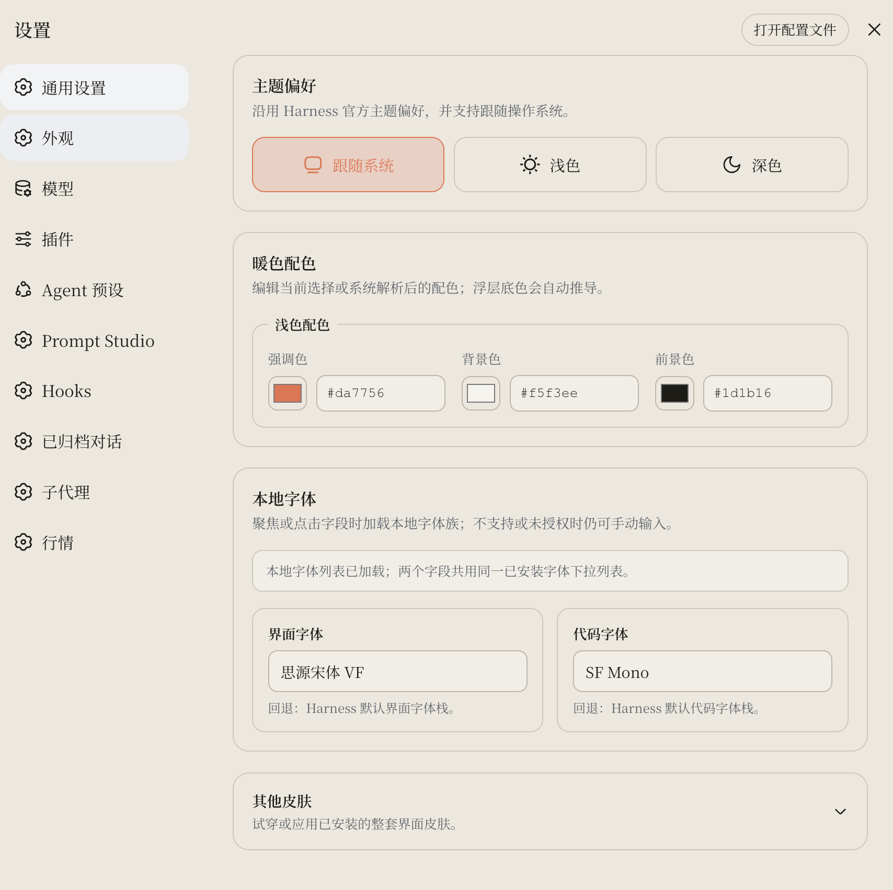
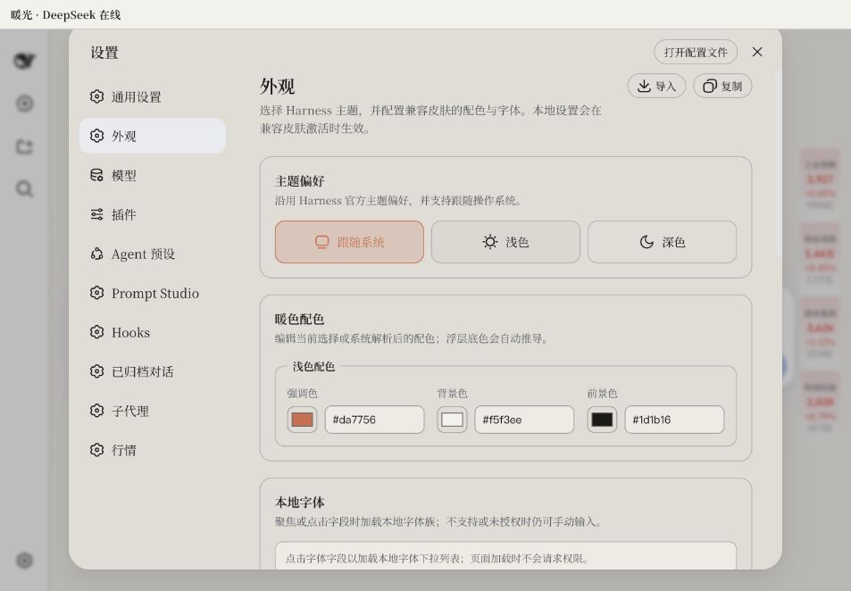

# DSH Appearance

中文 | [English](README.en.md)

为 DeepSeek Harness 提供一级「外观」设置页和可配置的 Claude Code 皮肤。配色、主题模式、本地字体、复制/导入与皮肤切换都集中在 **设置 → 外观**，不再埋在三层插件菜单里。





以上两张图均来自本地 Harness 实际界面。

## 功能

- **一级外观入口**：与「通用设置」并列，沿用 Harness 官方设置框架。
- **官方主题偏好**：跟随系统、浅色、深色，直接使用 Harness Theme Runtime。
- **三项配色**：强调色、背景色、前景色都支持调色盘和十六进制文字输入；浮层底色自动推导，避免第四个颜色与背景/前景冲突。
- **本地字体**：首次聚焦时读取已安装字体。界面字体和代码字体都是可编辑组合框：可以从本机已枚举到的候选中选择，也可以直接手动输入任意字体族；找不到时安全回退到 Harness 默认字体栈。
- **复制与导入一致**：两个动作共用同一条 `dsh-theme-v1:` 传输文本，复制后可直接粘贴导入。
- **皮肤试穿与应用**：真实加载已安装皮肤 bundle；试穿可无损退出，应用后在配置回读成功后刷新。
- **本地优先**：配置只保存在当前浏览器，字体枚举只在用户操作后发生。
- **中英双语**：界面跟随 Harness 语言；本 README 默认中文，英文文档完整镜像。

本仓库自包含的可配置皮肤是 Claude Code Terminal。外观页使用共享的
`--dsh-appearance-*` 契约；`dsh-web-ui` 皮肤合集中的 Ewin Warm Light 也已接入同一契约，
所以在 Ewin Warm 激活时修改配色会立即作用于 Ewin Warm。未接入该契约的其他皮肤不会被串色。

## 两套示例配置

### 暖陶纸 / Warm Terracotta

- 强调色：`#da7756`
- 浅色：`#f5f3ee` / `#1d1b16`
- 深色：`#1d1b16` / `#f5f3ee`
- 字体：`思源宋体 VF` / `SF Mono`

```text
dsh-theme-v1:{"format":"dsh-claude-code-appearance","version":2,"colors":{"light":{"accent":"#da7756","canvas":"#f5f3ee","surface":"#f1eee8","foreground":"#1d1b16"},"dark":{"accent":"#da7756","canvas":"#1d1b16","surface":"#262119","foreground":"#f5f3ee"}},"fonts":{"ui":"思源宋体 VF","code":"SF Mono"}}
```

### 深海蓝 / Deep Ocean

- 强调色：浅色 `#2563eb`，深色 `#70a5ff`
- 浅色：`#f6f8fb` / `#172033`
- 深色：`#111827` / `#e5edf7`
- 字体：`Avenir Next` / `Menlo`

```text
dsh-theme-v1:{"format":"dsh-claude-code-appearance","version":2,"colors":{"light":{"accent":"#2563eb","canvas":"#f6f8fb","surface":"#f2f3f5","foreground":"#172033"},"dark":{"accent":"#70a5ff","canvas":"#111827","surface":"#191e2a","foreground":"#e5edf7"}},"fonts":{"ui":"Avenir Next","code":"Menlo"}}
```

## 安装

要求：Node.js 22、pnpm 9、DeepSeek Harness `0.1.0-rc.6`。

```sh
git clone https://github.com/le-soleil-se-couche/dsh-appearance.git
cd dsh-appearance
pnpm install
pnpm build

dsh plugin --profile web add link:./packages/skins/skin-center
dsh plugin --profile web add link:./packages/skins/claude-code
node ./scripts/dsh-skin use claude-code
dsh web
```

如果当前 profile 已安装旧仓库 `dsh-skin-claude-code`，或已通过 `dsh-skins` / `dsh-web-ui-all`
加载旧版 `skin-center`，请先移除对应旧包，再安装本仓库的两个单元。新旧版本使用相同的
Cordis/plugin id，不能并装。

恢复官方外观：

```sh
node ./scripts/dsh-skin use official
```

## 使用

1. 打开 Harness「设置」。
2. 选择一级「外观」。
3. 调整主题与三项颜色；颜色会即时预览。
4. 点击字体字段，直接输入或从本地候选中选择。
5. 点击「复制」分享完整配置；点击「导入」粘贴同格式文本。
6. 在「其他皮肤」中试穿、应用或恢复官方默认。

## 开发与验证

```sh
pnpm install
pnpm build
pnpm typecheck
pnpm test
pnpm generate:check
```

两个可安装单元位于：

- `packages/skins/skin-center`：Appearance 设置页、字体枚举、配置传输、皮肤试穿与应用。
- `packages/skins/claude-code`：读取 `--dsh-appearance-*` 私有变量的 Claude Code 视觉层。

## 当前平台边界

Harness `0.1.0-rc.6` 的 `settings.section` 插槽尚未提供导航图标字段，因此左侧「外观」条目暂时使用宿主默认齿轮图标。插件没有修改 Harness 源码、`node_modules` 或设置导航 DOM。

- macOS：支持浏览器 Local Font Access；host 还可回退到 `fc-list` 或 `system_profiler`。
- Linux：应用链和路径使用 Node 跨平台调用；host 字体列表需要 `fontconfig`，缺少时仍可使用浏览器枚举或手动输入。
- Windows：repo CLI 由 Node 直接启动，DSH `.cmd` 通过 shell 调用，默认目录使用 `os.homedir()`，profile package link 使用 `junction`；字体可使用 Chromium Local Font Access，host 再回退到 Windows Fonts registry。
- 当前真实交互验证在 macOS 完成；Windows/Linux 分支已有单元测试，并配置了三平台 GitHub Actions matrix。首次公开 push 后以 CI 结果为准，仍欢迎对应平台的实机反馈。

## License

[BSD-3-Clause](LICENSE)
